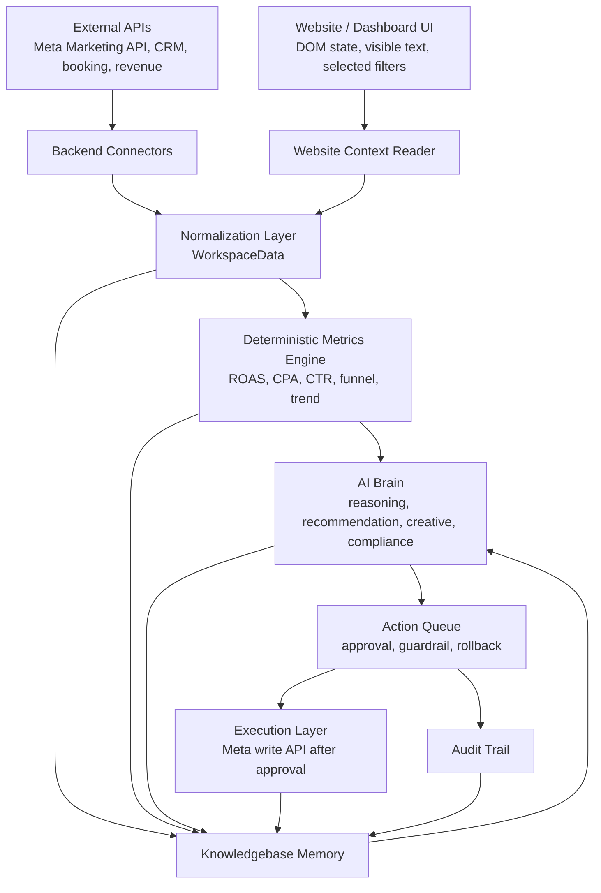
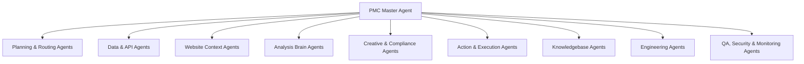

# PMC Ads Agent: AI Brain & Knowledgebase Design

## เป้าหมายของโครงการ

PMC Ads Agent คือระบบหลังบ้านสำหรับทีมคลินิกที่ใช้ AI เป็นสมองช่วยอ่านข้อมูลโฆษณาจริง วิเคราะห์ผลลัพธ์จริง แนะนำการตัดสินใจ และบันทึกประวัติการเรียนรู้ของระบบไว้ใช้วิเคราะห์ย้อนหลัง

ระบบนี้ต้องไม่เป็นแค่ chatbot ที่ตอบจากข้อความลอยๆ แต่ต้องทำงานจากข้อมูล 3 ชั้นพร้อมกัน:

1. ข้อมูลจริงจาก API เช่น Meta Marketing API, conversion events, ad account, campaign, ad set, ad, insight และ creative metadata
2. ข้อมูลจริงจากหน้าเว็บไซต์หรือ dashboard ที่ผู้ใช้เห็น เช่น KPI, table, filter state, selected campaign, error state และข้อความที่แสดงบน UI
3. ความรู้สะสมของระบบ เช่น decision history, audit trail, campaign learnings, creative learnings, audience learnings, compliance notes และผลลัพธ์หลังทำ action

AI ต้องตอบพร้อม evidence เสมอว่าใช้ข้อมูลอะไร คำนวณอย่างไร แนะนำอะไร และมีความเสี่ยงหรือ guardrail อะไรบ้าง

## สถานะระบบปัจจุบัน

โปรเจกต์นี้เป็น React + Vite + TypeScript dashboard พร้อม backend proxy ใน Vite/production server

ระบบที่มีอยู่แล้ว:

- Frontend dashboard ใน `src/App.tsx`
- Type กลางของข้อมูลใน `src/types.ts`
- Meta API proxy ใน `server/metaApiPlugin.ts`
- OpenAI proxy ใน `server/openAiPlugin.ts`
- Knowledge base สำหรับงาน redesign ใน `knowledge-base/dashboard-redesign/`
- Meta workspace model ชื่อ `WorkspaceData`
- Endpoint อ่านข้อมูลจริงจาก Meta:
  - `GET /api/meta/status`
  - `GET /api/meta/check`
  - `GET /api/meta/workspace`
  - `POST /api/meta/config`
  - `POST /api/meta/object-status`
  - `POST /api/meta/bulk-status`
  - `POST /api/meta/object`
  - `POST /api/meta/creative-launch`
- Endpoint ใช้ AI:
  - `GET /api/ai/status`
  - `POST /api/ai/marketer`
  - `POST /api/ai/creative`

หลักสำคัญ: token และ API key ต้องอยู่ฝั่ง server เท่านั้น ห้ามส่งไป browser

## ภาพรวมสถาปัตยกรรม



AI Brain ต้องไม่คำนวณ metric สำคัญด้วยการเดาเอง ถ้ามีสูตรแน่นอน เช่น ROAS, CPA, CTR, CVR, frequency, spend leakage, conversion rate ให้คำนวณด้วย code ก่อน แล้วส่งค่าที่ normalize แล้วให้ AI วิเคราะห์ต่อ

## หลักการออกแบบ AI เป็นสมองของระบบ

### 1. AI อ่านข้อมูลจริง ไม่แต่งข้อมูลเอง

AI ทุกตัวต้องรับ payload ที่มี source ชัดเจน เช่น:

- campaign id, campaign name, objective, status
- spend, revenue, ROAS, CPA, CTR, CPM, CPC, frequency
- leads, bookings, purchases, conversion value
- ad set targeting, placements, geo, age, audience
- ad creative id, thumbnail, copy, performance
- selected date preset และ fetchedAt
- UI context ที่ผู้ใช้กำลังเห็น

Prompt ต้องสั่งชัดเจนว่า:

- ใช้เฉพาะข้อมูลที่ส่งมา
- ห้ามเดาตัวเลข
- ถ้าข้อมูลไม่มี ให้ระบุว่า missing
- ทุกคำแนะนำต้องมี evidence
- ทุก action ต้องมี guardrail และ rollback note

### 2. Code คำนวณ ตัว AI อธิบายและตัดสินใจ

ชั้น deterministic metrics engine ควรรับผิดชอบ:

- รวม spend/revenue/conversions
- คำนวณ ROAS, CPA, CTR, CPC, CPM, CVR
- สร้าง funnel metrics
- ทำ trend รายวัน
- จัดอันดับ winner/loser
- ตรวจ threshold เบื้องต้น เช่น spend > 0 แต่ conversion = 0
- สร้าง candidate action ตาม rule

AI Brain รับข้อมูลที่คำนวณแล้วเพื่อ:

- อธิบายว่าเกิดอะไรขึ้น
- วิเคราะห์สาเหตุที่เป็นไปได้จาก evidence
- เลือก action ที่เหมาะสม
- จัดลำดับความสำคัญ
- เขียนคำแนะนำภาษาไทยให้ทีมใช้งานจริง
- สร้าง creative brief, hooks, copy และ work order
- เตือน compliance หรือ medical claim risk

### 3. ทุก write action ต้องผ่าน approval

AI ห้ามยิง API เปลี่ยนข้อมูลจริงโดยตรง

Flow ที่ถูกต้อง:

1. AI สร้าง recommendation
2. Backend ตรวจ guardrail
3. UI แสดง before/after, evidence, risk, confidence, rollback
4. ผู้ใช้ approve หรือ reject
5. Backend ยิง Meta write API
6. Sync workspace ใหม่
7. บันทึก audit event และ memory outcome

Action ที่มีความเสี่ยงสูง เช่น pause campaign, bulk pause ads, budget update, creative launch ต้องมีเงื่อนไขเพิ่ม:

- ข้อมูลต้องสดพอ
- มี spend/conversion volume เพียงพอ
- ระบุ object id ชัดเจน
- มี rollback path
- มี audit trail

## Agent Roles

ระบบนี้ควรพัฒนาเป็น multi-agent operating system โดยมี `PMC Master Agent` เป็นตัวคุมงานทั้งหมด Agent ย่อยไม่มีสิทธิ์ตัดสินใจข้ามขอบเขตหน้าที่ของตัวเอง และทุก action ที่กระทบข้อมูลจริงต้องผ่าน Master + approval gate ก่อนเสมอ

หลักการแบ่งงาน:

- 1 agent = 1 responsibility ที่ชัดเจน
- ทุก agent ต้องมี input/output contract
- Agent ที่วิเคราะห์ต้องอ้าง evidence
- Agent ที่เสนอ action ต้องส่งผ่าน Approval Gatekeeper
- Agent ที่ execute ต้องรับเฉพาะคำสั่งที่ผ่าน approval แล้ว
- Master Agent เป็นผู้รวมคำตอบ ตรวจ conflict และสั่งลำดับงาน

### PMC Master Agent

Master Agent คือ controller หลักของระบบ และเป็นตัวแทนการควบคุมของ Codex ในการพัฒนาและ orchestration

อำนาจหน้าที่:

- กำหนด roadmap และแตกงานเป็น task ย่อย
- เลือก agent ที่เหมาะสมกับแต่ละงาน
- ตรวจว่า agent ย่อยใช้ข้อมูลถูก source หรือไม่
- รวมคำตอบจาก agent ย่อยเป็น final decision
- ตรวจ conflict ระหว่าง agent เช่น Performance อยาก scale แต่ Compliance บอกว่า creative เสี่ยง
- อนุมัติ schema, API contract, memory contract และ execution policy
- สั่งให้ QA/Security ตรวจงานก่อนถือว่าเสร็จ
- ป้องกันไม่ให้ agent ย่อยยิง API จริงเอง

กฎของ Master:

- Master ต้องเห็น `WorkspaceData`, `WebsiteContext`, memory และ decision history ก่อนสั่งงานสำคัญ
- Master ต้องแยกงาน deterministic calculation ออกจาก AI reasoning
- Master ต้องบันทึกเหตุผลว่าทำไมเลือก action นั้น
- Master ต้อง reject output ที่ไม่มี evidence หรือมี metric ที่ไม่มี source
- Master ต้องบังคับให้ทุก write action มี before, after, guardrail, rollback และ audit event
- ก่อนสร้างคำสั่งเปลี่ยนสถานะใน Meta ต้องเทียบสถานะปัจจุบันก่อนเสมอ ถ้า campaign, ad set หรือ ad อยู่สถานะเดียวกับคำสั่งแล้ว ให้เปลี่ยนเป็น checklist/review item และห้ามส่งคำสั่งซ้ำ

กฎของข้อความบน UI:

- ข้อความที่แสดงในหน้าจอต้องพูดกับผู้ใช้งานโดยตรง ไม่ใช่อธิบาย implementation ให้ developer อ่าน
- หลีกเลี่ยงคำเชิงระบบ เช่น `source`, `AI Brain`, `PMC Master Agent`, `หลังผู้ใช้กด`, `เฉพาะรายการที่มาจาก...` เว้นแต่เป็นชื่อเมนูหรือ action ที่ผู้ใช้ต้องกดจริง
- Empty state ต้องบอกสถานะปัจจุบันและขั้นตอนถัดไปของผู้ใช้ เช่น "ยังไม่มีรายการที่ต้องอนุมัติ" และ "เมื่อคุณให้ AI วิเคราะห์ข้อมูลล่าสุด รายการที่ต้องตัดสินใจจะมาแสดงที่นี่"
- ถ้าข้อมูลมาจากสูตรหรือ metric guardrail ไม่ใช่ AI ที่ผู้ใช้สั่งวิเคราะห์ ห้ามเขียนให้ดูเหมือนเป็นคำแนะนำ AI

Workflow การพัฒนาใต้ Master:

1. Master รับ requirement
2. Planner Agent แตก requirement เป็น feature/task
3. Architecture Agent ตรวจผลกระทบกับระบบเดิม
4. Contract Agent กำหนด type/schema/API
5. Worker Agent ทำ implementation ตาม ownership
6. QA Agent ทดสอบ functional และ regression
7. Security Agent ตรวจ secrets, permissions, unsafe writes
8. Documentation Agent อัปเดตเอกสาร
9. Master review และสรุปผล

กฎการอัปเดตเอกสารระหว่างพัฒนา:

- เวอร์ชันล่าสุดของโปรเจกต์คือ `0.1.0`
- `docs/PROJECT_UPDATES.md` คือ update log กลางของโปรเจกต์
- ทุกครั้งที่มีการพัฒนา แก้บั๊ก ปรับ UI เปลี่ยน API เพิ่ม asset หรือเตรียม release ต้องเพิ่ม entry ใน `docs/PROJECT_UPDATES.md` ก่อน stage หรือ commit
- ถ้ามีไฟล์ preview, manual, PDF, screenshot หรือ asset สำหรับ release ให้จัดเก็บใน `docs/releases/<date>-v<version>/` และเพิ่ม index สั้นๆ ใน README ของโฟลเดอร์ release นั้น
- ห้ามถือว่างานเสร็จถ้า code/test เปลี่ยนแล้วแต่ยังไม่ได้อัปเดต update log และ release notes ที่เกี่ยวข้อง

### Agent Control Hierarchy



### Orchestrator Agent

หน้าที่:

- รับคำถามหรือคำสั่งจากผู้ใช้
- รวม context จาก API, UI และ knowledgebase
- เลือก agent ย่อยที่เหมาะสม
- สรุปคำตอบสุดท้ายเป็น action plan

อินพุต:

- user intent
- current workspace
- selected page/filter/object
- recent memory
- audit trail

เอาต์พุต:

- task plan
- routed payload
- final answer หรือ action queue

### Data Sync Agent

หน้าที่:

- ดึงข้อมูลจาก API จริง
- normalize เป็น `WorkspaceData`
- ตรวจความครบถ้วนของข้อมูล
- สร้าง sync summary

ข้อมูลที่ต้องบันทึก:

- sync id
- source API
- date preset
- fetchedAt
- counts: campaigns, ad sets, ads, time series rows
- error หรือ missing fields

### Performance Brain Agent

หน้าที่:

- วิเคราะห์ performance ของ campaign/ad set/ad
- หา spend leakage, scale opportunity, creative fatigue, tracking issue
- สร้าง recommendation ที่อิง metric จริง

ต้องตอบด้วย:

- what happened
- why it matters
- evidence
- recommendation
- confidence
- risk
- guardrail
- rollback note

### Creative Strategist Agent

หน้าที่:

- อ่าน ad-level insight และ creative signal
- สร้าง hook, primary text, headline, description
- สร้าง work order ให้ทีม content/design
- สกัด winning angle จาก ads ที่ performance ดี

ข้อจำกัด:

- ห้าม claim ผลลัพธ์เกินจริง
- ห้าม before/after promise ที่เสี่ยง
- ห้ามรับประกันผลลัพธ์ทางการแพทย์หรือความงาม
- copy ต้องใช้ได้จริงกับ Meta ads

### Website Context Reader Agent

หน้าที่:

- อ่าน context จากหน้าเว็บที่ผู้ใช้กำลังเห็น
- เข้าใจ selected tab, selected campaign, filters, table rows, modal, empty/error state
- ใช้ visible UI state ประกอบการตอบคำถาม

แหล่งข้อมูล:

- DOM text
- component state ที่เปิดเผยผ่าน frontend context
- URL/search params
- active tab
- selected object id
- current workspace snapshot

ห้ามใช้ Website Reader แทน API sync สำหรับตัวเลขจริง ถ้า metric มาจาก API ได้ ต้องใช้ API เป็น source of truth แล้วใช้หน้าเว็บเป็น context ว่าผู้ใช้กำลังดูอะไร

### Compliance Agent

หน้าที่:

- ตรวจคำโฆษณาและ creative brief สำหรับคลินิก
- flag ข้อความเสี่ยง เช่น รับประกันผล, หายขาด, เห็นผล 100%, ก่อนหลังเกินจริง
- เสนอข้อความแก้ที่ปลอดภัยกว่า

### Action Executor Agent

หน้าที่:

- รับ action ที่ผ่าน approval แล้วเท่านั้น
- เรียก backend endpoint สำหรับ Meta write API
- บันทึกผลลัพธ์และ error
- สั่ง sync ใหม่หลัง execute

ข้อจำกัด:

- ไม่รับคำสั่งจาก AI โดยตรงถ้าไม่มี approval id
- ไม่ execute action ที่ object id ไม่ชัดเจน
- ไม่ execute action ที่ไม่มี rollback note

### Knowledge Curator Agent

หน้าที่:

- แปลงข้อมูล sync, insight, recommendation, action และ outcome เป็น memory
- ลดข้อมูลซ้ำ
- สร้างบทเรียนย้อนหลัง
- เตรียม context ที่เกี่ยวข้องกลับไปให้ AI Brain

## Expanded Specialist Agent Roster

รายการนี้คือ agent roster แบบละเอียดสำหรับพัฒนาให้ระบบแบ่งหน้าที่มากที่สุดเท่าที่ practical ใน production โดยบาง agent อาจเป็น LLM agent, deterministic service, background job หรือ frontend context module ขึ้นกับงานจริง

### Control & Planning Agents

| Agent | Ownership | Output |
| --- | --- | --- |
| Master Controller Agent | คุมทิศทางทั้งหมด, resolve conflict, final decision | master decision, routed task, final response |
| Requirement Intake Agent | แปลงคำขอผู้ใช้เป็น intent และ acceptance criteria | intent brief |
| Planner Agent | แตกงานเป็น task, dependency และลำดับพัฒนา | implementation plan |
| Task Router Agent | เลือก agent ที่ควรทำงานแต่ละส่วน | routing map |
| Context Assembler Agent | รวม workspace, UI context, memory, audit | context bundle |
| Conflict Resolver Agent | ตรวจความเห็นขัดกันระหว่าง agent | conflict report |
| Approval Gatekeeper Agent | ตรวจว่า action พร้อมให้มนุษย์ approve หรือไม่ | approval request |
| Policy Controller Agent | เก็บกฎกลางของระบบ เช่น no direct write, no invented metrics | policy verdict |
| Prompt Governance Agent | ตรวจ prompt ว่าบังคับ evidence, schema และ safety ครบ | prompt review |
| Cost & Latency Agent | ประเมิน token, latency, cache และ model routing | cost plan |

### Data & API Agents

| Agent | Ownership | Output |
| --- | --- | --- |
| Meta Account Connector Agent | อ่าน account, user, currency, timezone | account profile |
| Meta Campaign Sync Agent | sync campaigns และ campaign insights | campaign dataset |
| Meta Ad Set Sync Agent | sync ad sets, budget, targeting, placements | ad set dataset |
| Meta Ad Sync Agent | sync ads, status, creative reference | ad dataset |
| Meta Creative Sync Agent | sync creative id, thumbnail, asset metadata | creative dataset |
| Meta Time Series Agent | sync daily insights และ trend rows | time series dataset |
| CRM Connector Agent | ดึง lead, booking, show-up, treatment จาก CRM ในอนาคต | CRM dataset |
| Booking Connector Agent | ดึง appointment status และ no-show ในอนาคต | booking dataset |
| Revenue Connector Agent | ดึงยอดขายและ payment outcome ในอนาคต | revenue dataset |
| Data Quality Agent | ตรวจ missing fields, stale data, API error, invalid metric | data quality report |
| Schema Mapper Agent | map raw API เป็น `WorkspaceData` | normalized workspace |
| Metric Calculator Agent | คำนวณ ROAS, CPA, CTR, CVR, funnel, trend | metric pack |
| Attribution Agent | เชื่อม ad/campaign กับ booking/revenue เมื่อมีข้อมูล clinic | attribution notes |
| Data Freshness Agent | ตรวจอายุข้อมูลก่อนอนุญาตให้ AI วิเคราะห์หรือ execute | freshness verdict |

### Website Context Agents

| Agent | Ownership | Output |
| --- | --- | --- |
| Website Context Reader Agent | อ่าน state หน้าเว็บที่ผู้ใช้กำลังดู | `WebsiteContext` |
| DOM Snapshot Agent | อ่าน visible text, card, table row, modal | DOM summary |
| UI State Agent | อ่าน active tab, selected object, filters, date preset | UI state |
| Table Reader Agent | แปลง row ที่แสดงเป็น object context | visible rows |
| Error State Agent | ตรวจ loading, empty, error, sync failed | UI diagnostic |
| User Intent From UI Agent | ตีความคำว่า "อันนี้" จาก object ที่ selected | resolved target |
| UX Friction Agent | ตรวจ flow ที่ผู้ใช้งานติดขัดจาก UI state | UX issue list |
| Report View Agent | อ่านข้อมูลที่อยู่ใน report screen | report context |

### Performance & Strategy Agents

| Agent | Ownership | Output |
| --- | --- | --- |
| Account Performance Agent | วิเคราะห์ภาพรวม ad account | account summary |
| Campaign Analyst Agent | วิเคราะห์ campaign-level performance | campaign insight |
| Ad Set Analyst Agent | วิเคราะห์ audience, placement, budget, CPA | ad set insight |
| Ad Analyst Agent | วิเคราะห์ ad-level performance | ad insight |
| Budget Optimization Agent | หา overspend, underspend, scale budget | budget recommendation |
| ROAS Strategy Agent | อ่าน ROAS/revenue เพื่อ scale หรือ protect budget | ROAS recommendation |
| CPA Control Agent | หา CPA สูงผิดปกติและ root cause | CPA diagnosis |
| Funnel Diagnosis Agent | หา stage ที่หลุดตั้งแต่ impression ถึง paid | funnel diagnosis |
| Trend & Anomaly Agent | หา trend, spike, drop, anomaly | anomaly report |
| Forecast Agent | ประเมินแนวโน้มถ้า spend/CPA/ROAS คงเดิม | forecast note |
| Experiment Design Agent | ออกแบบ A/B test หรือ split test | experiment plan |
| Winner Scaling Agent | หา campaign/ad ที่ควร scale แบบ staged | scale plan |
| Spend Leakage Agent | หา spend ที่ไม่มี conversion หรือ signal ต่ำ | leakage report |
| Learning Phase Agent | เตือน action ที่เสี่ยงกระทบ learning phase | learning risk |

### Creative & Content Agents

| Agent | Ownership | Output |
| --- | --- | --- |
| Creative Strategist Agent | สร้าง creative direction จาก insight จริง | creative strategy |
| Hook Analyst Agent | วิเคราะห์ hook ที่ CTR ดีหรือแย่ | hook finding |
| Thai Ads Copywriter Agent | เขียน primary text/headline ภาษาไทย | ad copy set |
| Visual Brief Agent | สร้าง brief ให้ designer/video editor | visual brief |
| Creative Fatigue Agent | ตรวจ frequency สูง, CTR ตก, fatigue | refresh recommendation |
| Winner Extraction Agent | สกัด angle ที่ชนะจาก ad performance | winning angle memory |
| Offer Agent | วิเคราะห์ offer, package, promotion | offer recommendation |
| Landing/Chat Flow Agent | วิเคราะห์จุดต่อจาก ad ไปแชท/booking | flow recommendation |
| Creative Launch Agent | เตรียม payload สำหรับ launch creative หลัง approval | launch draft |
| Asset Library Agent | จัดหมวดหมู่ asset, thumbnail, creative id | asset index |

### Audience & Targeting Agents

| Agent | Ownership | Output |
| --- | --- | --- |
| Audience Segment Agent | วิเคราะห์ segment จาก ad set targeting | audience insight |
| Geo Targeting Agent | วิเคราะห์พื้นที่ จังหวัด เมือง รัศมี | geo recommendation |
| Placement Agent | อ่าน publisher platform และ placement performance | placement notes |
| Device Agent | วิเคราะห์ device/platform signal | device finding |
| Retargeting Agent | ออกแบบ retargeting จาก funnel stage | retargeting plan |
| Lookalike Agent | เสนอ lookalike/source audience เมื่อข้อมูลพร้อม | lookalike plan |
| Exclusion Agent | หา audience ที่ควร exclude | exclusion notes |
| Lead Quality Agent | เชื่อม lead volume กับ booking/show-up/revenue | lead quality score |

### Compliance & Risk Agents

| Agent | Ownership | Output |
| --- | --- | --- |
| Medical Ads Compliance Agent | ตรวจ claim ทางคลินิก/ความงาม | compliance verdict |
| Meta Policy Agent | ตรวจ risk ตาม policy โฆษณา Meta | policy warning |
| Claim Rewriter Agent | rewrite claim เสี่ยงให้ปลอดภัยขึ้น | safer copy |
| Before/After Risk Agent | ตรวจคำหรือ visual ที่สื่อ before/after เกินจริง | risk flag |
| Sensitive Attribute Agent | ตรวจ copy ที่อาจพาดพิงรูปร่าง สุขภาพ หรือ insecurity | sensitive flag |
| Legal Review Handoff Agent | สร้างรายการที่ควรส่งให้คนตรวจ | legal review queue |

### Action & Execution Agents

| Agent | Ownership | Output |
| --- | --- | --- |
| Action Builder Agent | แปลง recommendation เป็น executable action draft | action draft |
| Risk Scoring Agent | ประเมิน risk ของ action ก่อนเสนอ approve | risk score |
| Approval Request Agent | เตรียม before/after/evidence ให้ UI approve | approval card |
| Meta Status Executor Agent | pause/activate campaign/ad set/ad หลัง approval | execution result |
| Meta Budget Executor Agent | update budget หลัง approval และ policy check | budget execution result |
| Meta Creative Launch Executor Agent | launch creative หลัง approval | creative launch result |
| Bulk Action Agent | แบ่ง bulk action เป็น batch พร้อม limit | batch execution plan |
| Rollback Agent | สร้างและ execute rollback path เมื่อจำเป็น | rollback result |
| Post-Action Sync Agent | sync ใหม่หลัง execute | refreshed workspace |
| Outcome Observer Agent | เปรียบเทียบ before/after หลัง 24h, 48h, 7d | outcome report |

### Knowledgebase & Memory Agents

| Agent | Ownership | Output |
| --- | --- | --- |
| Memory Writer Agent | เขียน memory ใหม่จาก sync, insight, decision | memory record |
| Memory Retriever Agent | ค้น memory ที่เกี่ยวข้องกับ object/context | memory bundle |
| Memory Dedup Agent | รวม memory ซ้ำและลด noise | deduped memory |
| Decision Historian Agent | บันทึก recommendation, approval, rejection, execution | decision record |
| Outcome Learning Agent | สรุปบทเรียนจากผลหลัง action | learning record |
| Business Preference Agent | จำ tone, service priority, forbidden claim, budget rule | preference memory |
| Daily Report Agent | สร้าง daily performance summary | daily report |
| Weekly Strategy Agent | สรุปบทเรียนและแผนรายสัปดาห์ | weekly report |
| Knowledge Curator Agent | ดูแล structure, tags, confidence, retention | curated knowledgebase |
| Retention Agent | ลบ/expire memory ที่เก่า ไม่มีประโยชน์ หรือเสี่ยง privacy | retention report |

### Engineering Agents

| Agent | Ownership | Output |
| --- | --- | --- |
| Frontend Implementation Agent | พัฒนา React UI ตาม design/system state | frontend patch |
| Backend Implementation Agent | พัฒนา API, proxy, persistence, execution layer | backend patch |
| Type & Schema Agent | ดูแล TypeScript types, JSON schema, validation | type/schema patch |
| API Contract Agent | กำหนด endpoint request/response contract | API spec |
| Integration Agent | ต่อ frontend/backend/API/AI เข้าด้วยกัน | integration patch |
| Refactor Agent | ลด duplication โดยไม่เปลี่ยน behavior | scoped refactor |
| Migration Agent | เตรียม data migration เมื่อย้าย memory ไป DB | migration plan |
| Documentation Agent | อัปเดต README, Agent.md, deployment notes | documentation patch |

### QA, Security & Monitoring Agents

| Agent | Ownership | Output |
| --- | --- | --- |
| Unit Test Agent | เพิ่ม/แก้ unit test สำหรับ logic สำคัญ | test patch |
| Integration Test Agent | ทดสอบ API flow เช่น sync, AI, execute | integration test result |
| UI QA Agent | ตรวจ responsive, empty/loading/error state | UI QA report |
| Regression Agent | ตรวจ feature เดิมไม่พัง | regression report |
| Security Agent | ตรวจ secrets, token location, unsafe API writes | security review |
| Permission Agent | ตรวจ scope เช่น `ads_read`, `ads_management` | permission report |
| Audit Agent | ตรวจ audit trail ครบทุก action | audit verification |
| Observability Agent | เพิ่ม logs, metrics, tracing ที่จำเป็น | monitoring plan |
| Incident Agent | วิเคราะห์ error production และเสนอ fix | incident report |
| Release Agent | เตรียม build, deploy checklist, rollback release | release checklist |

## Master-Controlled Agent Workflow

Agent ย่อยทุกตัวต้องทำงานผ่าน contract เดียวกัน เพื่อให้ Master ตรวจสอบและรวมผลได้

```ts
type AgentTaskEnvelope = {
  taskId: string
  requestedBy: 'master'
  agentName: string
  intent: string
  inputSources: Array<'meta_api' | 'website_ui' | 'knowledgebase' | 'user_input' | 'codebase'>
  payload: Record<string, unknown>
  constraints: {
    noInventedMetrics: boolean
    requireEvidence: boolean
    requireApprovalForWrites: boolean
    medicalCompliance: boolean
  }
}
```

```ts
type AgentTaskResult = {
  taskId: string
  agentName: string
  status: 'done' | 'blocked' | 'needs_review'
  summary: string
  evidence: string[]
  output: Record<string, unknown>
  proposedActions: Array<{
    actionType: string
    targetId: string
    risk: 'Low' | 'Medium' | 'High'
    requiresApproval: boolean
  }>
  memoryWrites: KnowledgeMemory[]
  blockers: string[]
}
```

Master ต้อง reject result เมื่อ:

- ไม่มี evidence
- อ้าง metric ที่ไม่มีใน payload
- action ไม่มี target id
- action เสี่ยงสูงแต่ไม่มี guardrail
- output ไม่ตรง schema
- แนะนำ write action โดยไม่ผ่าน approval
- มี conflict กับ compliance หรือ security policy

## Agent Development Priority

ลำดับการพัฒนาที่ควรทำก่อน:

1. Master Controller Agent + Task Router Agent
2. Context Assembler Agent
3. Data Quality Agent + Metric Calculator Agent
4. Website Context Reader Agent
5. Memory Writer/Retriever Agent
6. Decision Historian Agent
7. Approval Gatekeeper Agent
8. Outcome Observer Agent
9. Compliance Agent
10. Specialist analysis agents ที่เหลือ เช่น Budget, Creative, Audience, Funnel

เหตุผล: ถ้าไม่มี Master, context, memory, decision log และ approval gate ก่อน การเพิ่ม agent วิเคราะห์จำนวนมากจะทำให้ระบบตอบเยอะแต่ควบคุมยาก

## Knowledgebase Design

Knowledgebase ต้องเก็บทั้งข้อมูลดิบ ข้อมูลที่ normalize แล้ว เหตุผลของ AI และผลลัพธ์หลัง action เพื่อใช้เรียนรู้ย้อนหลัง

โครงสร้างแนะนำ:

```text
knowledge-base/
  runtime/
    raw/
      meta/
        YYYY-MM-DD/
          sync-{syncId}.json
    snapshots/
      workspace/
        workspace-{syncId}.json
    memories/
      campaign-memory.jsonl
      creative-memory.jsonl
      audience-memory.jsonl
      compliance-memory.jsonl
      business-preferences.jsonl
    decisions/
      recommendations.jsonl
      approvals.jsonl
      executions.jsonl
      rejected-actions.jsonl
    reports/
      daily/
        YYYY-MM-DD.md
      weekly/
        YYYY-WW.md
    schemas/
      memory.schema.json
      decision.schema.json
```

ใน production ควรย้าย runtime memory ไป database เช่น Postgres และใช้ markdown ใน `knowledge-base/` สำหรับเอกสารทีม, playbook, spec และสรุปที่มนุษย์อ่านง่าย

## Memory Item Schema

Memory ควรเป็น structured record ไม่ใช่ข้อความยาวอย่างเดียว

```ts
type KnowledgeMemory = {
  id: string
  type: 'campaign' | 'creative' | 'audience' | 'compliance' | 'business' | 'system'
  title: string
  summary: string
  evidence: Array<{
    source: 'meta_api' | 'website_ui' | 'user_input' | 'ai_analysis' | 'execution_result'
    sourceId?: string
    observedAt: string
    value: string
  }>
  entities: Array<{
    kind: 'campaign' | 'adset' | 'ad' | 'creative' | 'service' | 'audience'
    id?: string
    name: string
  }>
  metrics?: {
    spend?: number
    revenue?: number
    roas?: number
    cpa?: number
    ctr?: number
    conversions?: number
  }
  recommendation?: string
  outcome?: string
  confidence: number
  tags: string[]
  createdAt: string
  updatedAt: string
  expiresAt?: string
}
```

## Decision Record Schema

ทุกคำแนะนำและ action ต้องถูกบันทึกเป็น decision record

```ts
type DecisionRecord = {
  id: string
  syncId: string
  actor: 'ai' | 'human' | 'system'
  actionType: string
  target: {
    objectType: 'campaign' | 'adset' | 'ad' | 'creative' | 'account'
    objectId: string
    name: string
  }
  before: Record<string, unknown>
  recommendedAfter: Record<string, unknown>
  approvedAfter?: Record<string, unknown>
  evidence: string[]
  guardrail: string
  risk: 'Low' | 'Medium' | 'High'
  confidence: number
  status: 'suggested' | 'approved' | 'executed' | 'rejected' | 'failed' | 'rolled_back'
  userNote?: string
  executionResult?: Record<string, unknown>
  createdAt: string
  executedAt?: string
}
```

## Retrieval Strategy

เวลา AI Brain ต้องตอบคำถามหรือแนะนำ action ให้ดึง context ตามลำดับนี้:

1. Current workspace snapshot จาก API sync ล่าสุด
2. Current UI context จากหน้าเว็บที่ผู้ใช้กำลังดู
3. Recent decision records ของ object เดียวกัน
4. Long-term memory ของ campaign/ad set/ad/creative/audience เดียวกัน
5. Business preferences เช่น tone, service priority, forbidden claims, budget policy
6. Historical outcomes หลัง action เดิม

การดึง memory ต้อง filter ด้วย:

- object id
- service line
- date range
- memory type
- confidence
- freshness
- tags

AI ต้องระบุเมื่อใช้ข้อมูลเก่า เช่น "อ้างอิงจาก memory วันที่ ..." และถ้าข้อมูลเก่าเกิน threshold ต้องขอ sync ใหม่ก่อนแนะนำ action สำคัญ

## Website Context Reading

เป้าหมายของ Website Context Reader คือทำให้ AI รู้ว่าผู้ใช้กำลังดูอะไรบนเว็บจริง ไม่ใช่แค่รู้ข้อมูลใน database

Frontend ควรเปิด endpoint หรือ context object สำหรับอ่าน state ปัจจุบัน เช่น:

```ts
type WebsiteContext = {
  route: string
  activeTab: string
  datePreset: string
  dataState: 'loading' | 'live' | 'empty' | 'error'
  selectedCampaignId?: string
  selectedAdSetId?: string
  selectedAdId?: string
  visibleCards: string[]
  visibleTableRows: Array<{
    objectType: 'campaign' | 'adset' | 'ad'
    objectId: string
    title: string
    visibleMetrics: Record<string, string | number>
  }>
  modal?: {
    type: string
    title: string
    targetId?: string
  }
  lastError?: string
  capturedAt: string
}
```

แนวทางใช้งาน:

- เมื่อผู้ใช้ถามว่า "อันนี้ควรทำยังไง" ให้ AI อ่าน `WebsiteContext` เพื่อรู้ว่า "อันนี้" คือ campaign/ad/table row ไหน
- เมื่อผู้ใช้ถามตัวเลขจริง ให้ใช้ `WorkspaceData` จาก API เป็นหลัก
- เมื่อ UI แสดง error/empty state ให้ AI อธิบายตามสถานะนั้น เช่น ยังไม่ได้ sync, token ไม่พร้อม, ไม่มี data ใน date preset นี้

## AI Request Contract

ทุก endpoint ที่เรียก AI ควรส่ง payload แบบมี contract ชัดเจน

```ts
type AiBrainRequest = {
  intent: string
  workspace: WorkspaceData
  websiteContext?: WebsiteContext
  memories?: KnowledgeMemory[]
  decisions?: DecisionRecord[]
  constraints: {
    language: 'th'
    noInventedMetrics: true
    requireEvidence: true
    requireGuardrail: true
    requireRollback: true
    medicalCompliance: true
  }
}
```

ผลลัพธ์ต้องเป็น JSON schema ที่ frontend ใช้งานต่อได้ เช่น:

```ts
type AiBrainResponse = {
  summary: string
  findings: Array<{
    title: string
    explanation: string
    evidence: string[]
    confidence: number
    risk: 'Low' | 'Medium' | 'High'
  }>
  recommendations: Array<{
    type: string
    targetId: string
    targetName: string
    action: string
    expectedImpact: string
    guardrail: string
    rollbackNote: string
    executable: boolean
  }>
  memoryWrites: KnowledgeMemory[]
}
```

## Guardrails

ระบบต้อง enforce guardrail ทั้งใน prompt และใน backend code

Guardrails หลัก:

- ห้าม AI เดาตัวเลขหรือสร้าง metric เอง
- ห้าม AI execute write action โดยไม่มี human approval
- ห้ามยิง API ด้วย token จาก browser
- ห้ามเก็บ access token, API key หรือข้อมูลลับใน knowledgebase
- ห้ามใช้ข้อมูลเก่าเพื่อสั่ง action เสี่ยงสูง
- ห้ามแนะนำ claim ทางการแพทย์ที่เกินจริง
- ต้องมี rollback note สำหรับ action ที่เปลี่ยนสถานะจริง
- ต้องมี audit record สำหรับทุก approval/execution/rejection

## Operating Loop

รอบการทำงานมาตรฐาน:

1. Sync: ดึงข้อมูลจาก API จริง
2. Normalize: แปลงเป็น `WorkspaceData`
3. Calculate: คำนวณ KPI และ threshold ด้วย code
4. Read UI: อ่าน context จากหน้าเว็บที่ผู้ใช้กำลังดู
5. Retrieve Memory: ดึง knowledge ที่เกี่ยวข้อง
6. Reason: ให้ AI วิเคราะห์จากข้อมูลจริงเท่านั้น
7. Recommend: สร้างคำแนะนำพร้อม evidence
8. Approve: ผู้ใช้อนุมัติหรือปฏิเสธ
9. Execute: ยิง API จริงเฉพาะ action ที่ผ่าน approval
10. Observe: sync ใหม่และดูผลหลัง action
11. Remember: บันทึก decision, outcome และ lesson
12. Report: สรุป daily/weekly insight

## Roadmap แนะนำ

### Phase 1: Master Foundation & Contracts

เป้าหมาย: วางโครงควบคุมระบบ multi-agent ให้ทุก agent ทำงานผ่าน Master และมี contract เดียวกัน

งานหลัก:

- เพิ่ม endpoint กลาง `/api/ai/brain` สำหรับถาม AI ด้วย workspace + website context + memory
- เพิ่ม `Master Controller Agent`, `Task Router Agent`, `Context Assembler Agent`
- เพิ่ม `AgentTaskEnvelope` และ `AgentTaskResult` เป็น contract กลาง
- เพิ่ม JSON schema สำหรับ recommendation, decision record และ memory writes
- แยก deterministic metric calculation ออกจาก UI ให้ชัดเจน
- เพิ่ม policy หลัก: no invented metrics, no direct write, approval required

Agent ที่ต้องพร้อม:

- Master Controller Agent
- Requirement Intake Agent
- Planner Agent
- Task Router Agent
- Context Assembler Agent
- Policy Controller Agent
- Type & Schema Agent

Definition of Done:

- AI ทุก request วิ่งผ่าน `/api/ai/brain` หรือ contract กลาง
- Master ตรวจ source, evidence, schema และ guardrail ได้
- มี schema ชัดเจนสำหรับ input/output ของ agent
- ไม่มี agent ใด execute write action ได้เอง

### Phase 2: Real Data, Website Context & Runtime Knowledgebase

เป้าหมาย: ทำให้ AI รู้ข้อมูลจริงจาก API, รู้ว่าผู้ใช้กำลังดูหน้าไหน และเริ่มจำข้อมูลย้อนหลังได้

งานหลัก:

- เพิ่ม `WebsiteContext` exporter เช่น `window.__PMC_AGENT_CONTEXT__`
- ส่ง active tab, selected campaign/ad/ad set, date preset, visible rows, modal และ error state เข้า AI
- เพิ่ม `knowledge-base/runtime/` สำหรับ local development
- บันทึก AI result ลง decision log
- เพิ่ม writer สำหรับ `recommendations.jsonl`, `executions.jsonl`, `campaign-memory.jsonl`
- เพิ่ม memory retrieval ตาม object id และ tags
- เพิ่ม data quality/freshness check ก่อน AI แนะนำ action สำคัญ

Agent ที่ต้องพร้อม:

- Data Quality Agent
- Metric Calculator Agent
- Website Context Reader Agent
- UI State Agent
- Error State Agent
- Memory Writer Agent
- Memory Retriever Agent
- Decision Historian Agent

Definition of Done:

- AI ตอบได้ว่า "อันนี้" คือ object ไหนจากหน้าเว็บที่ผู้ใช้กำลังดู
- AI ใช้ `WorkspaceData` เป็น source of truth สำหรับตัวเลขจริง
- ทุก recommendation ถูกบันทึกลง decision log
- Memory สามารถค้นย้อนหลังตาม campaign/ad/ad set ได้
- ถ้าข้อมูลเก่าหรือ sync fail ระบบต้องเตือนก่อนวิเคราะห์

### Phase 3: Specialist Agents, Approval & Safe Execution

เป้าหมาย: เพิ่ม agent วิเคราะห์เฉพาะทางให้ครอบคลุม performance, creative, audience, compliance และ execution ที่ปลอดภัย

งานหลัก:

- เพิ่ม specialist analysis agents เช่น Campaign Analyst, Budget Optimization, Funnel Diagnosis, Creative Fatigue, Audience Segment
- เพิ่ม Compliance Agent สำหรับ claim ทางคลินิกและ Meta policy
- เพิ่ม Approval Gatekeeper Agent เพื่อสร้าง approval card พร้อม before/after/evidence/risk/rollback
- ต่อ execution layer เฉพาะ action ที่ผ่าน approval แล้ว เช่น pause/activate, bulk status, creative launch draft
- เพิ่ม audit trail ให้ครบ approve, reject, execute, fail, rollback

Agent ที่ต้องพร้อม:

- Campaign Analyst Agent
- Ad Set Analyst Agent
- Ad Analyst Agent
- Budget Optimization Agent
- Funnel Diagnosis Agent
- Creative Strategist Agent
- Audience Segment Agent
- Medical Ads Compliance Agent
- Approval Gatekeeper Agent
- Action Builder Agent
- Meta Status Executor Agent
- Post-Action Sync Agent
- Audit Agent

Definition of Done:

- ทุก recommendation มี evidence, confidence, risk, guardrail และ rollback
- UI แยกชัดเจนว่า action ไหนเป็น suggestion และ action ไหน executable
- High-risk action ต้องมี approval ก่อนเสมอ
- Execute สำเร็จแล้วต้อง sync ใหม่และสร้าง audit event
- Compliance สามารถ block หรือ rewrite copy เสี่ยงได้

Implementation status:

- เพิ่ม `specialistOutputs` ใน `/api/ai/brain` สำหรับ Campaign, Ad Set, Ad, Budget, Funnel, Creative, Audience, Compliance, Approval Gatekeeper และ Action Builder Agents
- เพิ่ม `approvalActions` แบบ approval-only ที่ไม่มี execution payload จาก AI Brain
- UI หน้า AI Marketer แสดงรายงาน Specialist Agents และ Approval-only Action Cards
- Queue หลักรับ action cards จาก AI Brain และอนุมัติเป็นแผนได้ โดยไม่เขียน Meta API
- ยังไม่เปิด execution layer จาก AI Brain output ใน Phase 3 รอบนี้

### Phase 4: Outcome Learning, Production Memory & Monitoring

เป้าหมาย: ทำให้ระบบเรียนรู้จากผลลัพธ์จริงหลัง action และพร้อมใช้งานระยะยาวใน production

งานหลัก:

- หลัง execute action ให้ sync ซ้ำตามช่วงเวลา เช่น 24h, 48h, 7d
- บันทึก outcome เทียบ before/after
- สร้าง learning เช่น "pause action แบบนี้ช่วยลด spend leakage" หรือ "creative angle นี้ scale ได้"
- ย้าย runtime log ไป Postgres หรือ production memory store
- เพิ่ม vector search สำหรับ long-form notes, playbook และ report
- เพิ่ม retention policy และ privacy rule
- เพิ่ม daily/weekly report generator
- เพิ่ม monitoring สำหรับ API error, AI error, failed execution, stale data

Agent ที่ต้องพร้อม:

- Outcome Observer Agent
- Outcome Learning Agent
- Daily Report Agent
- Weekly Strategy Agent
- Retention Agent
- Observability Agent
- Security Agent
- Incident Agent
- Release Agent

Definition of Done:

- ผู้ใช้ถามย้อนหลังได้ว่า AI เคยแนะนำอะไร ทำจริงไหม และผลเป็นอย่างไร
- Memory production ค้นได้จาก object id, service, tag, date range และ confidence
- ระบบมี daily/weekly report จากข้อมูลจริง
- มี monitor สำหรับ sync failure, stale data, failed execution และ unsafe action
- มี release/rollback checklist สำหรับ deploy production

Implementation status:

- เพิ่ม `POST /api/ai/outcomes` สำหรับ Outcome Observer, Outcome Learning, Monitoring และ Daily Report Agents
- เพิ่ม runtime JSONL สำหรับ `outcomes`, `learning-records`, `monitoring alerts` และ `phase-4 reports`
- เพิ่ม UI หน้า Reports สำหรับรัน `Phase 4 Learning & Monitoring`
- Phase 4 อ่าน decision/memory เดิมและ workspace ล่าสุดเพื่อสร้าง outcome observations
- ถ้า action ยังเป็น approval-only/suggested ระบบจะบันทึกเป็น `pending` และไม่สรุปผลแบบ causal
- Direct execution ยังปิดอยู่ และ learning ใช้เพื่อปรับคำแนะนำ/alert เท่านั้น

## Definition of Done

ระบบถือว่าใช้ AI เป็นสมองหลังบ้านได้จริงเมื่อ:

- AI วิเคราะห์จาก API data ล่าสุด ไม่ใช่ static mock
- AI เข้าใจหน้าเว็บที่ผู้ใช้กำลังดู
- ทุก recommendation มี evidence, confidence, risk, guardrail, rollback
- ทุก write action ต้องผ่าน approval
- ทุก action มี audit trail
- ทุก sync/recommendation/execution/outcome ถูกบันทึกใน knowledgebase
- ผู้ใช้ถามย้อนหลังได้ว่า "ครั้งก่อน AI แนะนำอะไร ทำจริงไหม แล้วผลเป็นยังไง"
- ระบบสามารถสรุปบทเรียนจากอดีตเพื่อใช้ในการตัดสินใจครั้งต่อไป
