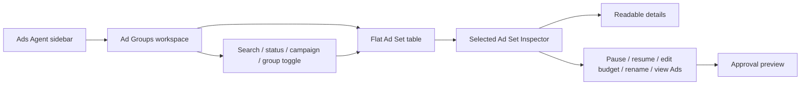
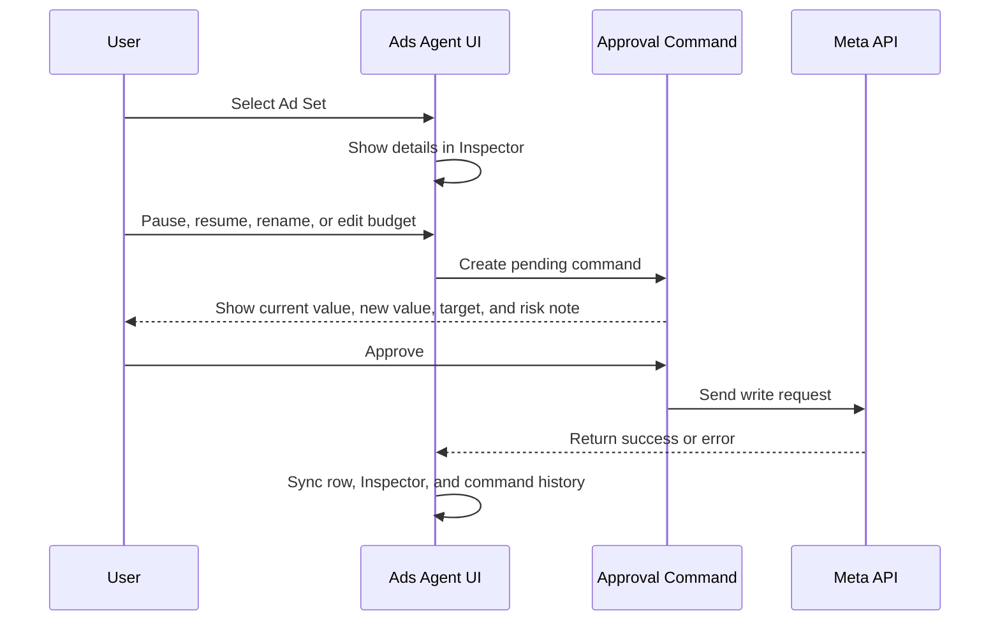
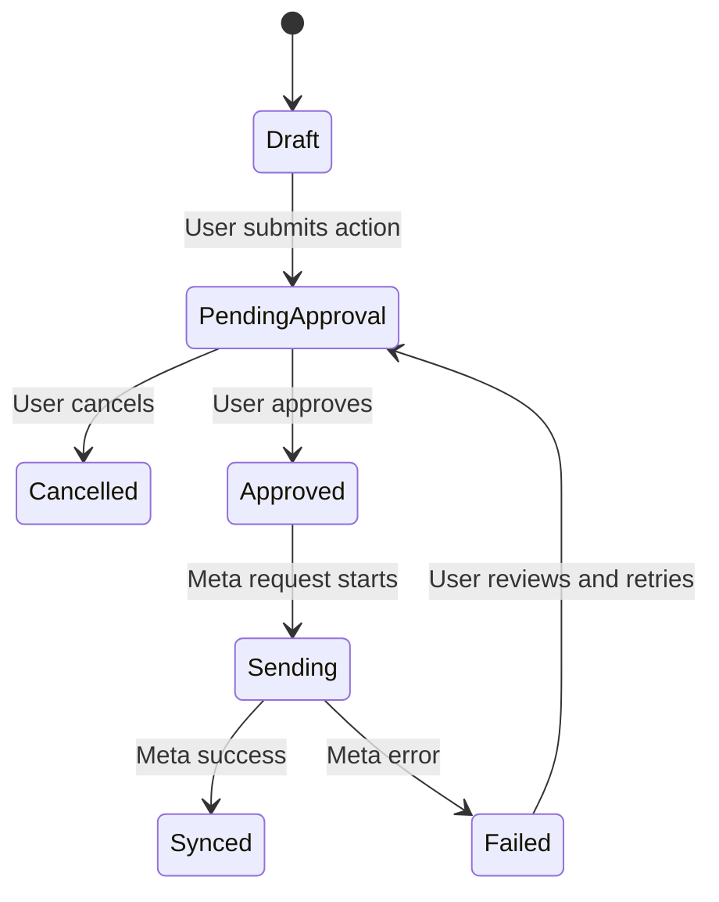

# Ad Groups Workspace Design

Date: 2026-05-29

## Goal

Design the next `/ads-agent` workspace for `Ad Groups` before implementation. This page focuses on Ad Set operations only: review Ad Sets, turn them on or off, edit budget, edit name, inspect Ads count/details, and send changes to Meta only after explicit user approval.

This spec covers the Ad Groups page structure and approval workflow. `Insights` and `Automation Ads` remain separate workspaces and should get their own specs before implementation.

## Approved Direction

Use a dedicated `Ad Groups` workspace with a `Split Inspector` layout.

- Default view is a flat Ad Set table for fast operations.
- The page supports filtering and optional grouping by parent Campaign.
- Selecting a row opens readable details in a right-side Inspector.
- Ads are not expanded inline inside the table. The table shows Ads count with a detail button.
- Every Meta write action creates an approval command first.
- Single-item approval is the default for this phase.
- The model should allow bulk approval later without forcing that behavior into phase 1.

## Scope

### In Scope

- Add or design a standalone `Ad Groups` workspace inside `/ads-agent`.
- Show Ad Set rows with operation-first data:
  - Status
  - Ad Set name
  - Parent Campaign
  - Budget
  - Ads count
  - Recent spend/result summary where available
  - Last synced state where available
- Actions:
  - Pause Ad Set
  - Resume Ad Set
  - Edit budget
  - Rename Ad Set
  - View Ads detail summary
- Require approval before any write reaches Meta.
- Keep approval copy readable: show current value, proposed value, target Ad Set, parent Campaign, and likely impact.
- Support `flat` and `group by Campaign` views without changing the core action flow.

### Out Of Scope

- Building `Insights` or `Automation Ads`.
- Managing individual Ads inline in the Ad Groups table.
- Creating or deleting Ad Sets.
- Editing Campaign settings from this page.
- Shipping bulk execution in phase 1. The data model can support future bulk mode, but the UI should default to single-item approval.
- Changing Meta API credentials, environment variables, or server setup.

## Layout

Desktop and wide tablet use a split layout:

- Left shell rail remains the current Ads Agent navigation.
- Main content column contains the page title, filters, and Ad Set table.
- Right Inspector displays the selected Ad Set and pending action preview.

Mobile and narrow tablet should collapse the Inspector:

- Table remains the primary surface.
- Selecting an Ad Set opens the Inspector as a drawer or stacked panel.
- Actions must remain thumb-friendly and not overflow horizontally.

## Primary UI Areas

### Header And Filters

The header should make the current workspace obvious:

- Title: `Ad Groups`
- Supporting copy: short Thai end-user copy explaining that the page manages Ad Sets.
- Search input for Ad Set or Campaign name.
- Filter chips or segmented controls:
  - All
  - Active
  - Paused
  - Has pending change
- Campaign filter menu.
- Toggle or segmented control for:
  - Flat view
  - Group by Campaign

### Ad Set Table

The table is optimized for scanning and repeated operations.

Recommended columns:

1. Status
2. Ad Set
3. Campaign
4. Budget
5. Ads
6. Recent result or spend
7. Actions

Rows should not expand into nested Ads. Use an Ads count cell such as `7 Ads` with a detail button that opens Ads summary in the Inspector.

### Right Inspector

The Inspector should answer: what is this Ad Set, what can I safely change, and what will be sent to Meta?

Content blocks:

- Identity:
  - Ad Set name
  - Ad Set ID suffix
  - Parent Campaign
  - Current status
- Budget:
  - Current budget
  - Budget type if available
  - Last synced timestamp if available
- Ads summary:
  - Ads count
  - Breakdown by active/paused if available
  - Button to view detail list without editing Ads inline
- Recent metrics:
  - Spend
  - Results
  - ROAS or unavailable state
- Actions:
  - Pause/resume
  - Rename
  - Edit budget
- Approval preview:
  - Current value
  - Proposed value
  - Target object
  - Operation type
  - Send/approve controls

## Approval Flow

Every write action follows the same lifecycle:

Approval command states:

## Data Model

The page should be built around small, explicit models so the future `Insights` and `Automation Ads` pages can reuse approval concepts without sharing UI internals.

### `AdGroupWorkspaceState`

- `searchQuery`
- `statusFilter`
- `campaignFilter`
- `viewMode`: `flat` or `groupedByCampaign`
- `selectedAdSetId`
- `pendingCommandIds`
- `syncState`

### `AdSetRow`

- `id`
- `name`
- `campaignId`
- `campaignName`
- `status`
- `dailyBudget`
- `lifetimeBudget`
- `budgetDisplay`
- `adsCount`
- `activeAdsCount`
- `pausedAdsCount`
- `spend`
- `results`
- `roas`
- `lastSyncedAt`
- `hasPendingCommand`

### `AdSetDetail`

- All row fields
- `adSummaries`
- `budgetSource`
- `deliveryState`
- `recentMetrics`
- `syncWarnings`
- `allowedActions`

### `ApprovalCommand`

- `id`
- `targetType`: `adset`
- `targetId`
- `targetName`
- `parentCampaignId`
- `parentCampaignName`
- `operation`: `pause_adset`, `resume_adset`, `rename_adset`, or `update_budget`
- `currentValue`
- `proposedValue`
- `status`: `draft`, `pending_approval`, `approved`, `sending`, `synced`, `failed`, or `cancelled`
- `createdAt`
- `approvedAt`
- `sentAt`
- `errorMessage`

## Components

Implementation should keep component boundaries narrow:

- `AdGroupsPage`: owns workspace state and page layout.
- `AdGroupsHeader`: title, search, filters, and view mode control.
- `AdSetTable`: renders flat rows and action entry points.
- `CampaignGroupedAdSets`: renders grouped view using the same row/action components.
- `AdSetRowActions`: pause/resume, edit budget, rename, and view Ads detail.
- `AdSetInspector`: selected Ad Set detail surface.
- `AdSetAdsSummary`: Ads count and read-only Ads detail list.
- `AdSetBudgetEditor`: budget form and validation.
- `AdSetRenameEditor`: name form and validation.
- `ApprovalCommandPreview`: readable pending command confirmation.
- `ApprovalCommandHistory`: optional lightweight history if existing data supports it.

The components can live in existing files for the first implementation if extraction would create churn, but the boundaries above should be clear in code.

## Validation And Error Handling

Validation happens before creating a pending command:

- Empty Ad Set name is blocked.
- Budget must be numeric and greater than zero.
- Budget edits must preserve existing budget type unless the API explicitly supports changing type.
- Pause/resume action must check current status before creating a command.

Meta request errors:

- Keep the command in `failed`.
- Show the reason in the Inspector.
- Let the user retry after reviewing the command.
- Do not update the row as if Meta accepted the change.

Stale data:

- If the row has stale sync state, show a small warning in the Inspector before approval.
- If the server detects the remote state changed after command creation, require refresh before sending.

Unavailable metrics:

- Show honest unavailable states.
- Do not invent ROAS, result count, or Ads breakdown values.

## Copy Guidelines

Use end-user Thai copy for visible labels. Keep developer/internal words out of the UI.

Recommended labels:

- `Ad Groups`
- `ค้นหา Ad Set หรือ Campaign`
- `ทั้งหมด`
- `กำลังเปิด`
- `หยุดอยู่`
- `รออนุมัติ`
- `จัดกลุ่มตาม Campaign`
- `เปิด Ad Set`
- `ปิด Ad Set`
- `แก้งบ`
- `แก้ชื่อ`
- `ดู Ads`
- `ตรวจคำสั่งก่อนส่ง Meta`
- `ส่งคำสั่งหลังอนุมัติ`

Avoid visible labels like:

- `payload`
- `mutation`
- `raw Meta object`
- `execution request`
- `debug command`

## Accessibility

- Row actions must be real buttons with clear accessible names.
- Status controls must not rely on color alone.
- The selected row must expose selected state visually and semantically.
- Inspector drawer on mobile must trap focus while open.
- Approval buttons must make the irreversible/write nature of the action clear.
- Forms must expose validation errors near the edited field.

## Testing

Automated tests should cover:

- `Ad Groups` renders as a separate workspace label.
- The page shows Ad Set rows rather than Campaign-only cards.
- Search filters rows by Ad Set and Campaign name.
- Status filter limits active/paused rows.
- Group by Campaign view preserves the same actions.
- Clicking pause/resume creates an approval command instead of immediately calling Meta.
- Editing budget creates an approval command with current and proposed values.
- Renaming creates an approval command with current and proposed names.
- Approving a command calls the Meta API mock.
- Meta errors are shown in the Inspector and leave the command recoverable.
- Ads count is visible and Ads detail is read-only in this workspace.

Manual browser QA:

- Desktop: table and Inspector fit without overlap.
- Tablet: split layout remains readable or collapses at the intended breakpoint.
- Mobile: Inspector opens as drawer/stacked panel with no horizontal overflow.
- Thai labels fit in buttons and table cells.
- Approval preview is readable before any Meta write.

## Future Hooks

This design should make later pages easier without blending them together:

- `Insights` can reuse read-only metric panels and selected-object context.
- `Automation Ads` can reuse approval command concepts but should have its own automation schedule/rule model.
- Bulk approval can reuse `ApprovalCommand` and add `ApprovalBatch` later.

## Acceptance Criteria

- The Ad Groups page is visually and functionally separate from Campaigns.
- Default view is a flat Ad Set table with filter and group controls.
- Selecting a row displays a readable Inspector.
- Pause/resume, budget edit, and rename all require approval before Meta writes.
- Ads are represented as count plus read-only detail, not inline editable nested rows.
- The design keeps future bulk approval possible without implementing it in phase 1.
- Error and stale-sync states are visible and do not pretend a failed Meta write succeeded.
