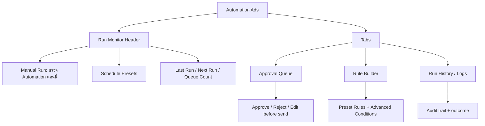
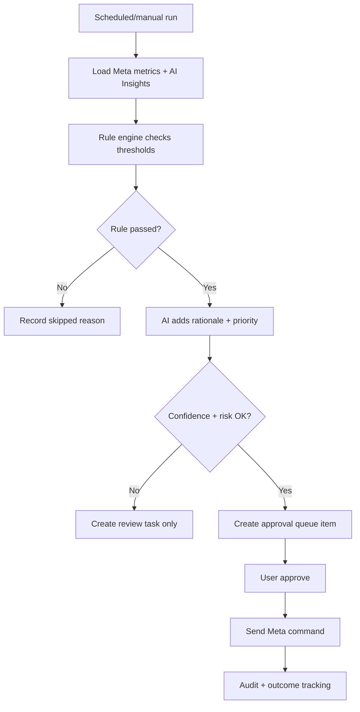

# Automation Ads Workspace Design

Date: 2026-05-29

## Goal

Design the next `/ads-agent` workspace for `Automation Ads`. This page should bring automation back safely after the current temporary pause by making rules configurable, runs auditable, recommendations explainable, and every Meta write approval-gated in phase 1.

This spec covers the Automation Ads workspace only. `Ad Groups` owns direct Ad Set operations, and `Insights` owns AI analysis. Automation Ads uses both as inputs but must remain a separate workflow.

## Approved Direction

Use a `Hybrid Safe Automation` model with a `Run Monitor + Tabs` layout.

- Phase 1 behaves as a Scheduled Approval Queue.
- Automation can inspect data and create queue items automatically.
- No action sends to Meta without user approval.
- Rule Builder supports presets plus advanced condition fields.
- Rule engine is the primary decision filter.
- AI Insights enriches rationale, priority, and evidence.
- Future guarded auto-run can be added only for low-risk rules after phase 1.

## Replacement Decision

The current Automation Ads placeholder should be replaced by the new workspace. The implementation should not keep the paused/coming-soon panel as the primary view once this spec is implemented.

Existing saved automation data can be reused if it maps cleanly to the new models, but old UI states that imply Automation Ads is paused should be removed from the active page.

## Scope

### In Scope

- Rebuild the Automation Ads page inside `/ads-agent`.
- Show run monitor status first.
- Add manual run action: `ตรวจ Automation ตอนนี้`.
- Support schedule presets:
  - Every 6 hours
  - Daily
  - Business days
- Add tabs for:
  - Approval Queue
  - Rule Builder
  - Run History / Logs
- Add preset rules with adjustable advanced conditions.
- Generate queue items from rule evaluation.
- Use AI Insights to explain, prioritize, and attach evidence.
- Require approval before any Meta write.
- Record run history, skipped reasons, conflicts, approvals, Meta results, and errors.

### Out Of Scope

- Full custom cron expressions in phase 1.
- Unguarded automatic Meta writes.
- Free-form arbitrary rule logic in phase 1.
- Rebuilding Insights or Ad Groups inside this page.
- Creating new ads or campaigns.
- Hiding approval requirements behind automation labels.

## Layout

Desktop and wide tablet:

- Keep the Ads Agent shell and navigation.
- Top area is the run monitor.
- Below the monitor is a tabbed workspace.
- Default tab should be `Approval Queue`.
- `Rule Builder` and `Run History` are adjacent tabs in the same page.

Mobile:

- Run monitor cards stack.
- Tabs remain visible and switch full-width panels.
- Queue items use compact rows with expandable details.
- Rule Builder uses stacked controls and clear save/cancel buttons.



## Primary UI Areas

### Run Monitor

The top monitor answers whether the automation system is safe and current.

Show:

- Automation status: active, paused, needs sync, or blocked.
- Last run timestamp.
- Next scheduled run.
- Schedule preset.
- Queue count.
- Failed queue count.
- Rules enabled count.
- Data freshness warning if Meta or AI data is stale.
- Primary button: `ตรวจ Automation ตอนนี้`.

Manual run should create a run record even if no queue items are produced.

### Approval Queue Tab

Queue items are proposed actions that require human approval.

Each queue item should show:

- Action type.
- Target object type and name.
- Current value or status.
- Proposed value or status.
- Rule that generated it.
- AI rationale if available.
- Evidence metrics.
- Confidence.
- Risk.
- Approval controls.
- Skipped/conflict/blocked state where relevant.

Allowed phase-1 actions:

- `pause_loser`
- `reduce_budget`
- `increase_winner`
- `flag_fatigue`
- `create_review_task`

Only `pause_loser`, `reduce_budget`, and `increase_winner` may become Meta write commands in phase 1, and only after approval. `flag_fatigue` and `create_review_task` are review-only outputs unless later mapped to a safe write action.

### Rule Builder Tab

Rule Builder should default to safe presets and expose advanced fields only when needed.

Preset types:

- `pause_loser`: CPA high or ROAS low after minimum spend/data volume.
- `reduce_budget`: waste score high but not severe enough to pause.
- `increase_winner`: ROAS/CPA strong, enough volume, and frequency under limit.
- `flag_fatigue`: frequency rising, CTR falling, CPA rising, or ROAS falling.
- `create_review_task`: confidence low, data stale, conflict detected, or rule cannot safely write.

Advanced fields:

- Target scope: account, campaign, ad set, ad.
- Time window.
- Minimum spend.
- Minimum impressions.
- Minimum clicks.
- Minimum conversions.
- Confidence threshold.
- Risk limit.
- Budget change limit.
- Frequency limit.
- CPA/CPL threshold.
- ROAS threshold.
- Waste score threshold.
- Fatigue score threshold.
- Schedule preset.
- Enabled/disabled toggle.

Phase 1 should not allow arbitrary free-form conditions. Keep the editable surface constrained to known safe fields.

### Run History / Logs Tab

Run history should make automation explainable and auditable.

Each run record should show:

- Run ID.
- Trigger type: manual or scheduled.
- Started timestamp.
- Completed timestamp.
- Data freshness.
- AI insight version or timestamp.
- Rule versions used.
- Items generated.
- Items skipped.
- Conflicts.
- Errors.
- Approved/executed count if approvals happened after the run.

## Rule Model

```text
Rule = {
  id,
  name,
  presetType,
  targetScope,
  timeWindow,
  minSpend,
  minImpressions,
  minClicks,
  minConversions,
  confidenceThreshold,
  riskLimit,
  actionType,
  budgetChangeLimit,
  frequencyLimit,
  cpaThreshold,
  roasThreshold,
  wasteScoreThreshold,
  fatigueScoreThreshold,
  schedulePreset,
  enabled,
  version,
  updatedAt
}
```

Rules should be versioned. Queue items and run history must reference the rule version that generated them so later edits do not rewrite history.

## Decision Engine

Automation Ads uses a hybrid decision engine:

- Rule engine is the primary filter.
- AI Insights enriches rationale, priority, and evidence.
- Rules can pass without AI, but high-risk actions should remain review-only if AI context is unavailable.
- AI can propose context, but it cannot bypass rule guardrails.



## Approval Flow

Approval item states:

```text
draft -> queued -> approved -> sending -> executed
queued -> rejected
sending -> failed -> retry_or_cancel
queued -> conflict_review
queued -> blocked
```

Every approval item must include:

- Target object.
- Action type.
- Current state/value.
- Proposed state/value.
- Rule ID and version.
- Evidence metrics.
- AI rationale if available.
- Confidence.
- Risk.
- Guardrail summary.
- Rollback note where practical.
- Approver.
- Approved timestamp.
- Meta request result.

## Scheduling

Phase 1 schedule presets:

- Manual only.
- Every 6 hours.
- Daily.
- Business days.

No custom cron in phase 1.

Scheduling behavior:

- Scheduled runs create run records.
- Scheduled runs can create queue items.
- Scheduled runs do not send Meta writes without approval.
- If a previous run is still processing, the next run should be skipped or marked blocked.
- The UI should show next run and last run clearly.

## Data Inputs

Automation Ads reads:

- Meta metrics and object hierarchy.
- Derived metrics from Insights where available.
- AI Insights recommendations and confidence.
- Existing approval state.
- Rule definitions and versions.
- Run history and previous outcomes.

It should not depend on stale Insights output for write recommendations without lowering risk and confidence. If AI data is stale, rule-only review tasks are allowed; direct queue items for write commands should be restricted.

## Conflict Handling

Conflicts must stop execution and create review items.

Examples:

- Two rules propose different actions for the same target.
- One rule proposes increasing budget while another proposes reducing budget.
- A rule proposes enabling a target that another rule flags as fatigue.
- Current Meta state changed since queue creation.
- Budget change exceeds rule limit.

Conflict queue items are not approvable until resolved.

## Validation And Error Handling

Meta data stale:

- Block write queue items.
- Allow review tasks with stale warning.

AI API unavailable:

- Rule engine can still evaluate.
- Rationale falls back to deterministic rule reason.
- High-risk or budget-changing actions become review tasks or blocked items.

Rule invalid:

- Disable save.
- Show validation near the field.
- Do not run invalid rules.

Meta send failure:

- Mark queue item as `failed`.
- Store error message.
- Allow retry or cancel.
- Do not mark action executed.

Duplicate queue item:

- Do not create duplicate active queue items for the same target/action/rule version.
- Link the new run to the existing active queue item.

Budget guardrail exceeded:

- Block queue item.
- Explain which budget limit was exceeded.

## Copy Guidelines

Use user-facing Thai copy.

Recommended labels:

- `Automation Ads`
- `ตรวจ Automation ตอนนี้`
- `รอบตรวจล่าสุด`
- `รอบถัดไป`
- `คิวรออนุมัติ`
- `กฎที่เปิดใช้งาน`
- `ปรับเงื่อนไข`
- `ประวัติการตรวจ`
- `สร้างคิวแล้ว`
- `ต้องอนุมัติก่อนส่ง Meta`
- `ข้ามเพราะข้อมูลยังไม่พอ`
- `ติด conflict ต้องตรวจ`
- `ส่ง Meta สำเร็จ`
- `ส่ง Meta ไม่สำเร็จ`

Avoid visible internal wording:

- `cron`
- `mutation`
- `raw rule payload`
- `debug event`
- `unsafe auto-run`

## Components

Implementation should aim for these boundaries:

- `AutomationAdsPage`: owns layout, selected tab, and run/queue/rule state.
- `AutomationRunMonitor`: top status cards and manual run action.
- `AutomationScheduleControl`: schedule preset display and editing.
- `AutomationTabs`: queue, rules, logs.
- `AutomationApprovalQueue`: queue list and item states.
- `AutomationQueueItem`: action details and approval controls.
- `AutomationRuleBuilder`: preset and advanced condition controls.
- `AutomationRulePresetCard`: preset summary and status.
- `AutomationAdvancedConditions`: threshold and guardrail fields.
- `AutomationRunHistory`: run records and outcomes.
- `AutomationConflictReview`: conflict display and resolution state.
- `evaluateAutomationRules`: deterministic rule engine.
- `buildAutomationQueueItem`: queue item normalizer.
- `createAutomationRunRecord`: audit/run history helper.

## Data Model

### `AutomationWorkspaceState`

- `activeTab`
- `selectedRuleId`
- `selectedQueueItemId`
- `isRunning`
- `runError`
- `schedulePreset`
- `nextRunAt`
- `lastRunAt`

### `AutomationRule`

- Matches the `Rule` model above.

### `AutomationRun`

- `id`
- `triggerType`: `manual` or `scheduled`
- `startedAt`
- `completedAt`
- `status`: `running`, `completed`, `failed`, `skipped`
- `schedulePreset`
- `metaSyncedAt`
- `aiInsightAnalyzedAt`
- `ruleVersions`
- `generatedQueueItemIds`
- `skippedReasons`
- `conflictIds`
- `errorMessage`

### `AutomationQueueItem`

- `id`
- `runId`
- `ruleId`
- `ruleVersion`
- `targetType`
- `targetId`
- `targetName`
- `actionType`
- `currentValue`
- `proposedValue`
- `evidence`
- `aiRationale`
- `confidence`
- `risk`
- `status`
- `guardrailSummary`
- `rollbackNote`
- `approval`
- `metaResult`

### `AutomationConflict`

- `id`
- `targetId`
- `ruleIds`
- `queueItemIds`
- `reason`
- `status`
- `createdAt`

## Testing

Automated tests should cover:

- Automation Ads no longer renders the paused placeholder as the primary page.
- Run Monitor shows last run, next run, queue count, and enabled rule count.
- Manual run creates an `AutomationRun` record.
- Schedule preset updates next run display.
- Rule threshold changes alter generated queue output.
- Invalid rule fields block save.
- Rule pass with sufficient confidence creates approval queue item.
- Rule pass with low confidence creates review task only.
- AI unavailable falls back to deterministic rationale and blocks high-risk writes.
- Conflicting rules create conflict review instead of approvable actions.
- Approval queue item does not call Meta before approval.
- Approved item calls Meta mock and stores result.
- Meta failure leaves item failed and retryable.
- Duplicate active queue items are not created for the same target/action/rule version.

Manual browser QA:

- Desktop: Run Monitor and tabs fit without overlap.
- Mobile: tabs and rule fields stack cleanly with no horizontal overflow.
- Thai labels fit in buttons, queue rows, and rule controls.
- Queue, Rule Builder, and Run History states are visually distinct.

## Future Hooks

- Add guarded auto-run after phase 1 only for low-risk rules with proven outcomes.
- Add custom cron after schedule presets are stable.
- Add rule outcome learning based on executed queue results.
- Connect high-confidence Insights recommendations into suggested rules.
- Connect Reports to export automation run history and outcomes.

## Acceptance Criteria

- Automation Ads opens as a real workspace, not a paused placeholder.
- The page uses Run Monitor + Tabs layout.
- User can run automation checks manually.
- User can select schedule presets.
- User can configure preset rules with advanced condition fields.
- Rule engine produces queue items from metrics and guardrails.
- AI Insights can enrich rationale and priority but cannot bypass rules.
- Every Meta write remains approval-gated.
- Conflicts, stale data, AI errors, and Meta errors are visible and auditable.
