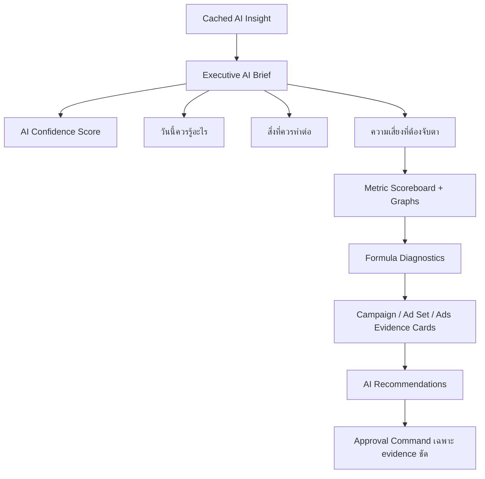
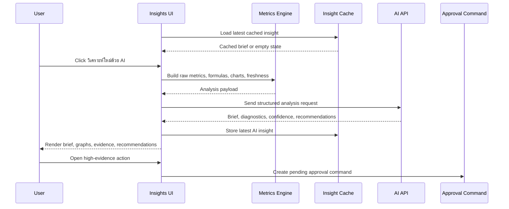

# Insights AI Analysis Workspace Design

Date: 2026-05-29

## Goal

Design the next `/ads-agent` workspace for `Insights`. This page must use a real AI API analysis flow, not static frontend-only summaries. It should open with a readable AI brief, then provide charts, exact metrics, formula diagnostics, evidence, confidence, and approval-gated recommendations.

This spec covers the Insights workspace only. `Ad Groups` has its own approved design spec, and `Automation Ads` should remain a separate future workspace.

## Approved Direction

Use an `AI Brief First` layout.

- The first screen answers: what happened, what matters, what should the team do next, and what risk needs attention.
- The brief is generated by the AI API from real Meta data, derived formulas, chart series, freshness state, attribution state, and object hierarchy.
- The page shows the latest cached AI insight immediately.
- A user can run `วิเคราะห์ใหม่ด้วย AI` to refresh the analysis after syncing data or changing the date window.
- Every AI finding must show a confidence score.
- Charts and scoreboard values must come from the same computed metric source.
- Recommendations are generated primarily as review items. Only high-evidence actions can open approval commands, and no Meta write is sent without approval.

## Measurement Research Basis

The Insights model separates reported performance, diagnostic formulas, and causal/incremental measurement.

### Reported Performance

Use platform-reported metrics for current operating decisions:

- `spend`
- `impressions`
- `reach`
- `clicks`
- `actions`
- `action_values`
- conversion counts
- conversion value
- attribution setting
- date window

The standard performance formulas follow widely used ads reporting definitions:

```text
CTR = clicks / impressions
CPC = spend / clicks
CPM = spend / impressions * 1000
CVR = conversions / clicks
CPA = spend / conversions
ROAS = conversion_value / spend
Frequency = impressions / reach
```

### Diagnostic Decomposition

The AI should not only say that CPA or ROAS changed. It should explain which upstream driver changed.

```text
CPA = CPC / CVR
CPC = CPM / (CTR * 1000)
```

This lets Insights classify likely causes:

- CPM up: auction, audience, or placement cost pressure.
- CTR down: creative, hook, offer, or message fatigue.
- CVR down: landing/page flow, offer quality, lead quality, or tracking issue.
- Frequency up with CTR down: likely creative fatigue.
- Spend share higher than result share: budget waste or poor allocation.

### Advanced Measurement

Platform attribution is useful for operations, but it is not the same as incrementality. The AI should label reported metrics separately from incrementality estimates or recommendations.

Incrementality formulas:

```text
Incremental Conversions = conversions_treatment - adjusted_conversions_control
Relative Lift = incremental_conversions / conversions_control
iCPA = spend / incremental_conversions
iROAS = incremental_conversion_value / spend
```

MMM-style lag and saturation concepts:

```text
Adstock_t = spend_t + decay * Adstock_(t-1)
Saturated Effect = response_max * Adstock_t^shape / (half_saturation^shape + Adstock_t^shape)
Marginal ROAS = delta_estimated_incremental_value / delta_spend
```

Phase 1 should not pretend to run full MMM or lift tests if the required control data is absent. It should expose these as future-ready measurement concepts and mark them as unavailable or low-confidence unless the input data supports them.

## Sources Used

- Google Ads Help: conversion rate, performance columns, CPA/ROAS-related reporting, and Conversion Lift metrics.
- Google Meridian: MMM model specification, including media saturation/lagging, reach/frequency, and ROI calibration concepts.
- Meta Robyn: open-source MMM package using adstock and saturation curves.
- Meta Conversions API help: measurement and attribution across the customer journey and lift study support.
- IAB/MRC viewable impression guidelines: viewability as a quality layer for impression measurement.
- Gordon, Zettelmeyer, Bhargava, and Chapsky, `A Comparison of Approaches to Advertising Measurement`, Marketing Science 2019: observational methods often fail to match randomized experiments in ad measurement.
- Lewis and Rao, `The Unfavorable Economics of Measuring the Returns to Advertising`, Quarterly Journal of Economics 2015: informative ad experiments can require very large samples.

Reference URLs are listed at the end of this spec.

## Scope

### In Scope

- Design a standalone `Insights` workspace inside `/ads-agent`.
- Use a real AI API workflow for analysis.
- Show cached insight on load and allow manual AI refresh.
- Include metric scoreboard and charts.
- Include formula diagnostics for CPA, ROAS, frequency, waste, fatigue, and momentum.
- Include AI confidence score per brief/finding/recommendation.
- Include evidence cards tied to Campaign, Ad Set, or Ad objects.
- Include chart annotations from the AI where data supports them.
- Generate recommendations that can be reviewed or routed into approval.
- Open approval commands only when recommendation evidence is clear enough.
- Keep all Meta write behavior approval-gated.

### Out Of Scope

- Building `Automation Ads`.
- Building the Ad Groups implementation.
- Running true MMM, Conversion Lift, or holdout studies in phase 1 without proper input data.
- Creating automated Meta writes directly from Insights.
- Changing Meta tokens, environment variables, or account connection setup.
- Replacing the Reports page.

## Layout

Desktop and wide tablet:

- Keep the current Ads Agent shell and left navigation.
- Main panel starts with a wide AI brief section.
- Below the brief, show metric scoreboard and graph sections.
- Then show formula diagnostics and evidence cards.
- Recommendations sit after evidence, not before it.

Mobile:

- AI brief remains first.
- Metric cards stack in two or one columns depending on width.
- Charts use fixed responsive height and no horizontal overflow.
- Evidence cards and recommendations stack.



## Primary UI Areas

### AI Brief

The top section should read like a short operating brief:

- Current analysis timestamp.
- Date window.
- Account/page context.
- Confidence level.
- Three summary blocks:
  - `วันนี้ควรรู้อะไร`
  - `ควรทำอะไรต่อ`
  - `ความเสี่ยงที่ต้องจับตา`
- Primary action: `วิเคราะห์ใหม่ด้วย AI`.
- Secondary state: cached/stale indicator.

The brief must never hide data problems. If data is stale or low volume, state that before recommendations.

### Metric Scoreboard

Scoreboard cards:

- Spend
- Results or leads
- CPA/CPL
- ROAS
- CTR
- CPC
- CPM
- Frequency
- Conversion rate

Each card should show:

- Current value.
- Comparison to previous period where available.
- Unavailable state if denominator is zero or data is missing.
- Link to the underlying chart or evidence section when useful.

### Graphs

Phase 1 chart set:

- Spend vs results trend.
- CPA/CPL trend.
- ROAS trend where conversion value exists.
- CTR and CPC trend.
- Frequency trend.
- Optional stacked contribution chart for spend share vs result share.

Graph data must come from the same derived metrics used by the scoreboard.

### Formula Diagnostics

Use formulas to explain root cause:

```text
CPA Driver = classify(CPM change, CTR change, CVR change)
ROAS Driver = classify(value_per_conversion, CPA, conversion volume)
Fatigue Score = weighted(rising_frequency, falling_ctr, rising_cpa, falling_roas)
Waste Score = spend_share - result_share
Momentum = current_7d_metric / previous_7d_metric - 1
```

Suggested diagnostic cards:

- `CPA แพงขึ้นเพราะอะไร`
- `ROAS ลดจากอะไร`
- `Creative fatigue`
- `Budget waste`
- `Momentum ของ Campaign`
- `Data quality warning`

### Evidence Cards

Each evidence card should tie the AI claim back to real objects:

- Object type: Campaign, Ad Set, or Ad.
- Object name and ID suffix.
- Metric values used.
- Date window.
- Formula result.
- Confidence.
- Link/action to open the relevant workspace where possible.

### Recommendations

Recommendations are generated after evidence:

- Read-only recommendation by default.
- High-evidence recommendation can open approval command.
- Complex automation recommendation routes to future `Automation Ads`.

Recommendation examples:

- Pause or reduce a losing Ad Set.
- Flag creative fatigue.
- Shift budget review to a better-performing Campaign or Ad Set.
- Refresh creative angle.
- Investigate tracking if data quality is poor.

## AI Analysis Flow



## AI API Contract

The frontend should send structured data, not prose-only context.

### Request Shape

```text
{
  account: {
    id,
    name,
    currency,
    timezone
  },
  dateWindow: {
    preset,
    start,
    end,
    previousStart,
    previousEnd
  },
  attribution: {
    setting,
    actionAttributionWindows,
    changedFromPreviousWindow
  },
  freshness: {
    metaSyncedAt,
    aiAnalyzedAt,
    staleReason
  },
  rawMetrics: {
    account,
    campaigns[],
    adSets[],
    ads[]
  },
  derivedMetrics: {
    scoreboard,
    trends,
    formulaDiagnostics,
    wasteScores,
    fatigueScores,
    momentumScores
  },
  recommendationsContext: {
    existingRecommendations[],
    approvalHistory[],
    blockedActions[]
  }
}
```

### Response Shape

```text
{
  brief: {
    title,
    summary,
    whatChanged[],
    whatToDoNext[],
    risks[]
  },
  confidence: {
    overall,
    level,
    reasons[]
  },
  metricDiagnostics[],
  problemCards[],
  chartAnnotations[],
  evidenceCards[],
  recommendations[],
  dataWarnings[]
}
```

## Confidence Model

Every AI brief, finding, and recommendation should expose confidence.

```text
Confidence =
  data_volume_score
  + freshness_score
  + metric_consistency_score
  + attribution_quality_score
  + trend_stability_score
  - volatility_penalty
```

Confidence inputs:

- Data volume: enough impressions, clicks, and conversions for the claim.
- Freshness: Meta sync and AI analysis age.
- Metric consistency: raw metrics and derived formulas point in the same direction.
- Attribution quality: stable attribution settings and usable conversion data.
- Trend stability: signal appears across enough days, not only one spike.
- Volatility penalty: large swings or small samples lower confidence.

Display levels:

- `สูง`: enough data, fresh sync, stable signal, no major attribution warning.
- `กลาง`: useful signal but some limits.
- `ต่ำ`: data is sparse, stale, volatile, or attribution is unstable.

Low confidence findings can still be shown, but they must not open direct approval commands.

## Recommendation And Approval Rules

Insights should not become Automation Ads. It can create recommendations and only open direct approval for simple, high-evidence actions.

Direct approval allowed in phase 1:

- Pause Ad Set or Ad if the object is clearly underperforming and enough data exists.
- Reduce budget if waste score is high and trend is stable.
- Flag creative fatigue for review.
- Create a review task for a Campaign or Ad Set.

Route to other workspaces:

- Ad Set name or budget edits route to Ad Groups when they require deeper context.
- Campaign-level edits route to Campaigns.
- Multi-step or recurring rules route to future Automation Ads.
- Report generation routes to Reports.

Approval command payload must include:

- Recommendation ID.
- Evidence IDs.
- Target object.
- Current value.
- Proposed action.
- Confidence.
- Risk note.
- User approval state.

## Validation And Error Handling

AI API unavailable:

- Show cached insight if available.
- Show last analyzed timestamp.
- Let the user retry.
- Do not create new recommendations from stale failed output.

Meta data unavailable:

- Show setup or sync required state.
- Disable AI refresh until enough data exists.

Derived formula unavailable:

- Do not divide by zero.
- Show `รอข้อมูล` or `คำนวณไม่ได้จากข้อมูลช่วงนี้`.
- Pass unavailable fields explicitly to AI instead of sending zeros that could be misread.

Attribution changed:

- Warn that period-over-period comparison may be unreliable.
- Lower confidence for conversion and ROAS claims.

AI output inconsistent:

- If AI recommendation conflicts with computed formulas, show the formula value and keep the recommendation in review-only state.
- Do not open approval command for inconsistent findings.

## Copy Guidelines

Use end-user Thai copy for visible labels.

Recommended labels:

- `Insights`
- `วิเคราะห์ใหม่ด้วย AI`
- `สรุปล่าสุดจาก AI`
- `ความมั่นใจ`
- `วันนี้ควรรู้อะไร`
- `สิ่งที่ควรทำต่อ`
- `ความเสี่ยงที่ต้องจับตา`
- `ตัวเลขสำคัญ`
- `กราฟแนวโน้ม`
- `วิเคราะห์สาเหตุ`
- `หลักฐานที่ใช้`
- `คำแนะนำที่ควรตรวจ`
- `ต้องอนุมัติก่อนส่ง Meta`
- `ข้อมูลยังไม่พอ`

Avoid visible internal wording:

- `payload`
- `raw object`
- `execution request`
- `model debug`
- `mutation`

## Components

Implementation should aim for these boundaries:

- `InsightsPage`: owns page state, cache state, and layout.
- `InsightsBriefPanel`: top AI brief.
- `InsightsConfidenceBadge`: shared confidence display.
- `InsightsMetricScoreboard`: exact metric cards.
- `InsightsTrendCharts`: chart set.
- `InsightsFormulaDiagnostics`: formula root-cause cards.
- `InsightsEvidenceCard`: real object evidence.
- `InsightsRecommendationList`: reviewable AI recommendations.
- `InsightsRefreshButton`: AI refresh action and loading state.
- `InsightsDataWarning`: stale/missing/attribution warnings.
- `buildInsightsAnalysisPayload`: raw metrics plus derived formulas.
- `deriveInsightsMetrics`: deterministic formula engine.
- `normalizeInsightsAiResponse`: schema validation and UI-safe normalization.

## Data Model

### `InsightsWorkspaceState`

- `datePreset`
- `selectedObjectId`
- `selectedObjectType`
- `isAiRunning`
- `cachedInsight`
- `aiError`
- `dataWarnings`
- `lastAnalyzedAt`

### `InsightsDerivedMetric`

- `key`
- `label`
- `value`
- `previousValue`
- `changeRate`
- `formula`
- `sourceFields`
- `availability`

### `InsightsFinding`

- `id`
- `title`
- `summary`
- `severity`
- `confidence`
- `metricKeys`
- `evidenceIds`
- `chartAnnotationIds`
- `recommendedNextStep`

### `InsightsRecommendation`

- `id`
- `title`
- `targetType`
- `targetId`
- `targetName`
- `evidenceIds`
- `confidence`
- `requiresApproval`
- `canOpenApprovalCommand`
- `blockedReason`
- `handoffWorkspace`

## Testing

Automated tests should cover:

- Cached insight renders before a new AI call.
- `วิเคราะห์ใหม่ด้วย AI` sends raw metrics, derived formulas, freshness, and attribution metadata.
- Formula engine does not divide by zero.
- Scoreboard and charts use the same derived metric values.
- Confidence changes when data is stale, sparse, volatile, or attribution changes.
- Low-confidence recommendations cannot open approval commands.
- High-evidence write actions create pending approval commands instead of sending Meta writes directly.
- AI API error falls back to cached insight.
- Missing Meta data disables AI refresh with a clear state.
- Thai labels render without overlap in desktop and mobile layouts.

Manual browser QA:

- Desktop: AI brief, scoreboard, graphs, diagnostics, evidence, and recommendations fit without overlap.
- Mobile: sections stack cleanly and charts remain readable.
- AI loading, error, empty, cached, and stale states are visibly different.
- No recommendation hides its confidence or evidence.

## Future Hooks

- Add true incrementality results if lift experiment data becomes available.
- Add MMM-style marginal ROAS if channel-level time series and calibration data become available.
- Feed high-confidence recommendations into Automation Ads rule creation later.
- Feed chart annotations and AI brief into Reports PDF generation.

## Acceptance Criteria

- Insights opens with the latest cached AI brief.
- User can run a fresh AI API analysis manually.
- The page shows exact metrics, charts, formula diagnostics, and evidence.
- Every AI insight and recommendation has confidence.
- Low-confidence or unsupported claims are clearly marked.
- Recommendations do not send Meta writes directly.
- Approval commands are available only for simple, high-evidence actions.
- Data warnings are visible when metrics are stale, sparse, unavailable, or affected by attribution changes.

## References

- Google Ads Help, `Conversion rate: Definition`: https://support.google.com/google-ads/answer/2684489?hl=en-EN
- Google Ads Help, `About columns in your statistics table`: https://support.google.com/google-ads/answer/2454071?hl=en
- Google Ads Help, `Understand your Conversion Lift based on users measurement data`: https://support.google.com/google-ads/answer/14102450?hl=en-GB
- Google Meridian, `Model specification`: https://developers.google.com/meridian/docs/advanced-modeling/model-spec
- Meta Robyn GitHub repository: https://github.com/facebookexperimental/Robyn
- Meta Business Help, `About Conversions API`: https://www.facebook.com/business/help/AboutConversionsAPI
- IAB/MRC, `MRC Viewable Impression Guidelines`: https://www.iab.com/guidelines/mrc-viewable-impression-guidelines/
- Gordon, Zettelmeyer, Bhargava, and Chapsky, `A Comparison of Approaches to Advertising Measurement`: https://pubsonline.informs.org/doi/10.1287/mksc.2018.1135
- Lewis and Rao, `The Unfavorable Economics of Measuring the Returns to Advertising`: https://academic.oup.com/qje/article-abstract/130/4/1941/1914592
